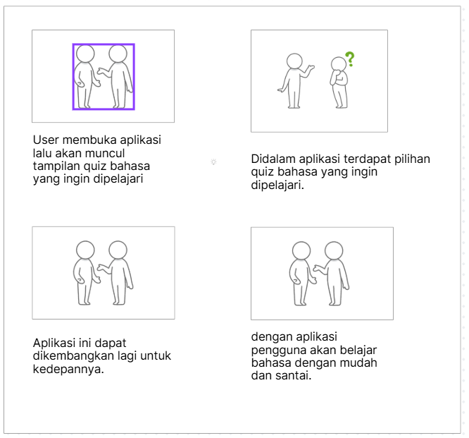
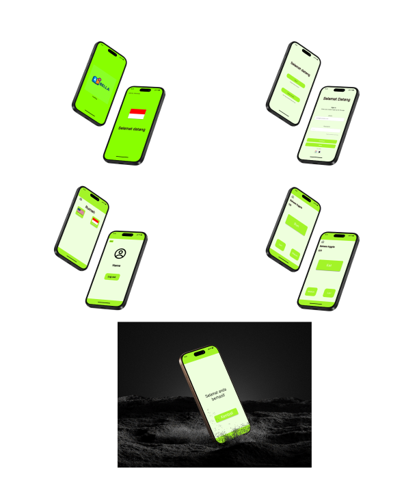
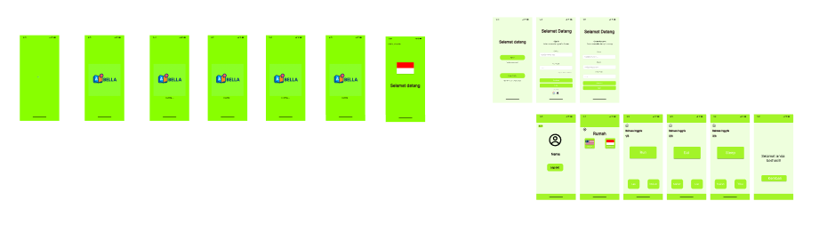

### Nama: Bagus Aditya Hermawan
### Nim: 312410382
### Kelas: TI.24.A.3
### Mata Kuliah: Pemrograman Mobile 1
### Projek Android: Aplikasi Quiz Bahasa

### Berikut adalah alur langkah dalam pembuatan program aplikasi quiz bahasa:
1. Membuat Storyboard
### .

Dalam Storyboard ini menggambarkan alur penggunaan aplikasi pembelajaran bahasa berbasis kuis. Pengguna memulai dengan membuka aplikasi, kemudian sistem menampilkan halaman kuis bahasa. Di dalam aplikasi tersedia beberapa pilihan kuis bahasa yang dapat dipilih sesuai kebutuhan pengguna. Setelah memilih kuis, pengguna dapat berinteraksi langsung dengan aplikasi untuk belajar bahasa secara mudah dan santai. Aplikasi ini juga dirancang agar dapat terus dikembangkan di masa depan dengan penambahan fitur dan materi pembelajaran lainnya.

2. Wireframme
### .

Wireframe ini dibuat untuk tahap sketsa desain yang akan nanti digunakan. berupa desain dengan warna hitam dan putih serta masih menggunakan kotak-kotak untuk fiturnya.

3. Mockup
### .

Mockup ini memperlihatkan gambaran tampilan aplikasi pembelajaran bahasa yang dibuat sederhana dan ramah pengguna. Aplikasi diawali dengan layar pembuka dan halaman bendera, lokasi, dan selamat datang untuk menyambut pengguna. Setelah itu, pengguna dapat masuk atau mendaftar akun dengan mudah melalui sign in dan create account. Pada halaman utama, terdapat pilihan menu kuis bahasa. Saat mulai mengerjakan kuis, tampilan dibuat nyaman dan interaktif agar proses belajar terasa santai. Mockup ini dirancang untuk memberikan pengalaman belajar bahasa yang mudah dipahami.

4. UI dan UX
### .

UI dibuat sebagai desain akhir yang sudah dikasih warna dan desain yang lainnya agar user ketika menggunakann aplikasi tersebut merasa nyaman dan dari desain ini juga supaya menarik banyak pengguna agar memakai aplikasi ini.
Berikut adalah link untuk UX-nya: https://youtu.be/ZAXhDvBjJiA?si=6F80Z4OvfDoq68NB.

### Hasil akhir aplikasi android studio

