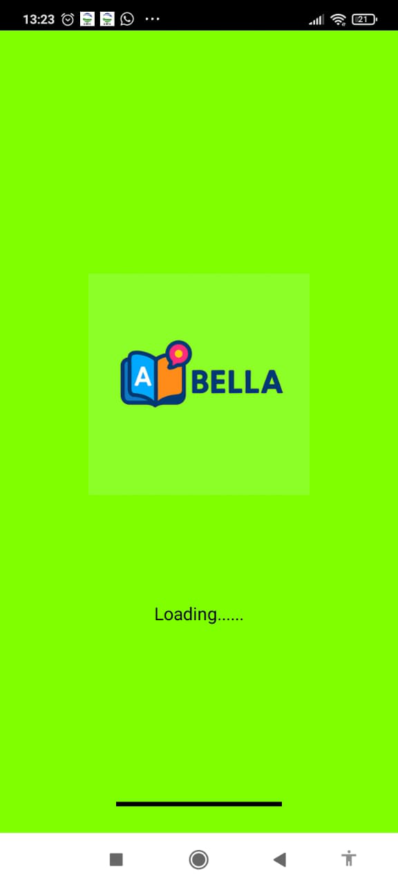
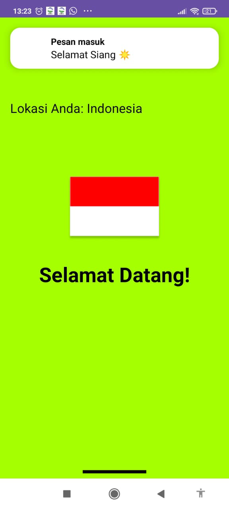
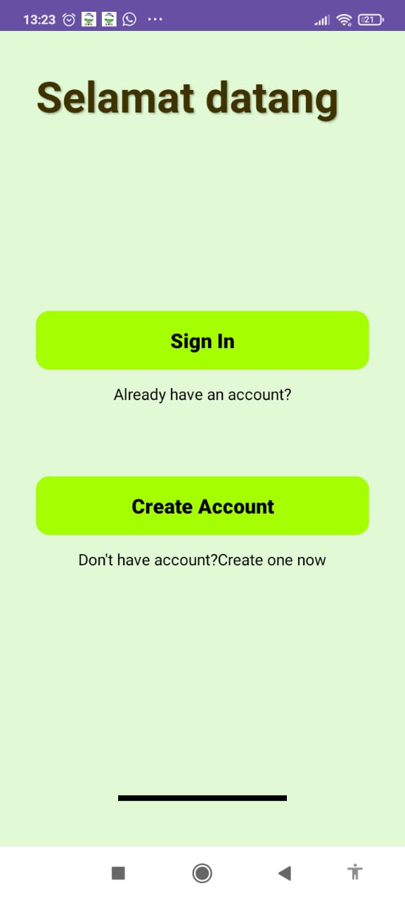
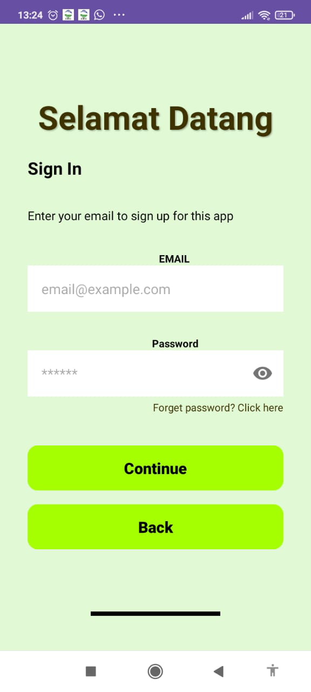
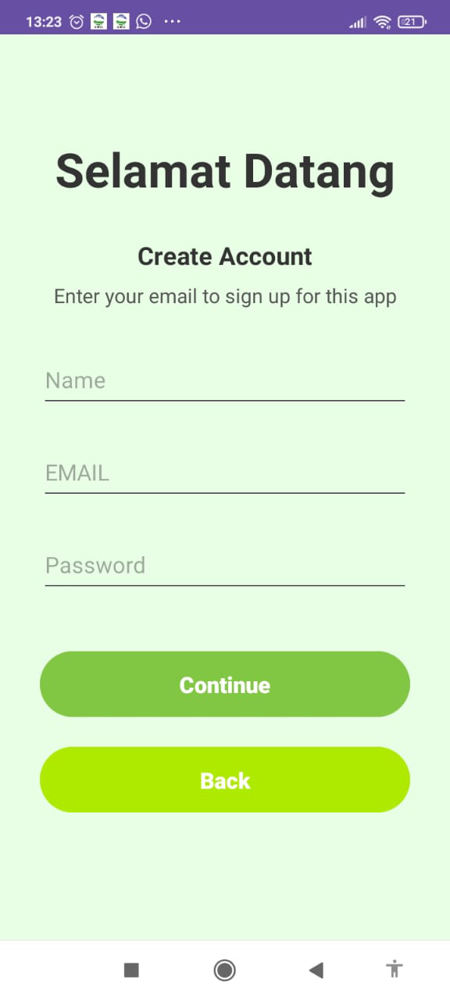
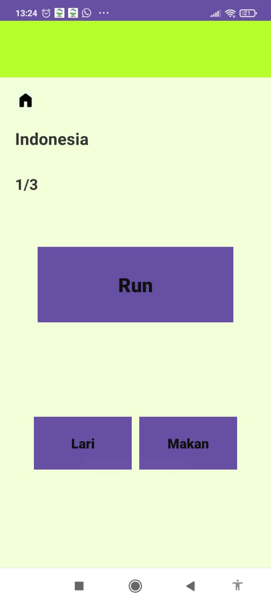
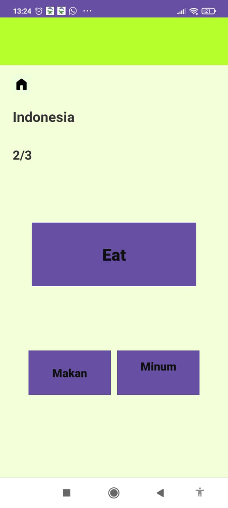
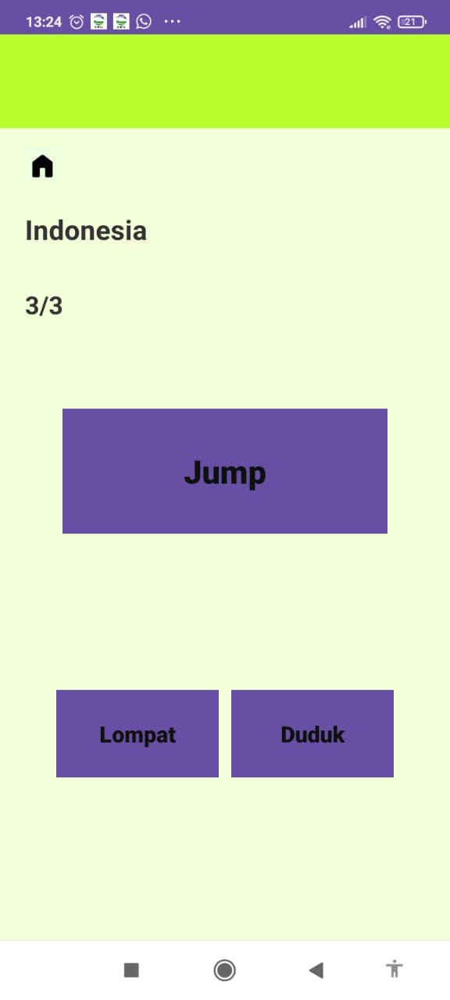
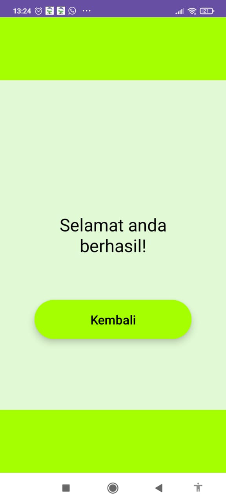
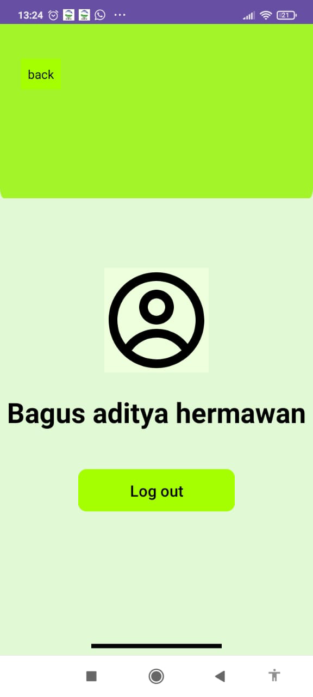

# Assalamu'alaikum wr.wb
# Perkenalkan:
# Nama: Bagus Aditya Hermawan
# Nim: 312410382
# Kelas: TI.24.A.3
# Mata Kuliah: Pemrograman Mobile 1
# Projek Android: Aplikasi Quiz Bahasa

### Berikut adalah alur langkah dalam pembuatan program aplikasi quiz bahasa:
1. Membuat Storyboard
### .

Dalam Storyboard ini menggambarkan alur penggunaan aplikasi pembelajaran bahasa berbasis kuis. Pengguna memulai dengan membuka aplikasi, kemudian sistem menampilkan halaman kuis bahasa. Di dalam aplikasi tersedia beberapa pilihan kuis bahasa yang dapat dipilih sesuai kebutuhan pengguna. Setelah memilih kuis, pengguna dapat berinteraksi langsung dengan aplikasi untuk belajar bahasa secara mudah dan santai. Aplikasi ini juga dirancang agar dapat terus dikembangkan di masa depan dengan penambahan fitur dan materi pembelajaran lainnya.

2. Wireframme
### .

Wireframe ini dibuat untuk tahap sketsa desain yang akan nanti digunakan. berupa desain dengan warna hitam dan putih serta masih menggunakan kotak-kotak untuk fiturnya.

3. Mockup
### .

Mockup ini memperlihatkan gambaran tampilan aplikasi pembelajaran bahasa yang dibuat sederhana dan ramah pengguna. Aplikasi diawali dengan layar pembuka dan halaman bendera, lokasi, dan selamat datang untuk menyambut pengguna. Setelah itu, pengguna dapat masuk atau mendaftar akun dengan mudah melalui sign in dan create account. Pada halaman utama, terdapat pilihan menu kuis bahasa. Saat mulai mengerjakan kuis, tampilan dibuat nyaman dan interaktif agar proses belajar terasa santai. Mockup ini dirancang untuk memberikan pengalaman belajar bahasa yang mudah dipahami.

4. UI dan UX
### .

UI dibuat sebagai desain akhir yang sudah dikasih warna dan desain yang lainnya agar user ketika menggunakann aplikasi tersebut merasa nyaman dan dari desain ini juga supaya menarik banyak pengguna agar memakai aplikasi ini.
Berikut adalah link untuk UX-nya: https://youtu.be/ZAXhDvBjJiA?si=6F80Z4OvfDoq68NB.

5. Click Up
### .

Clik Up disini tempat saya memperbarui/update hal yang saya lakukan dari pengerjaan langkah awal sampai langkah akhir projek ini. link Clickup: https://app.clickup.com/90181799349/v/s/90187467033.

### Hasil akhir aplikasi android studio
###### .

Ini adalah tampilan ic_launcher dari aplikasi yang telah saya buat di dalam HP android.

###### .

Ini awal ketika aplikasi dibuka. berguna untuk loading aplikasi ketika dibuka.

###### .

Fitur lokasi dengan notif salam secara real time, ucapan selamat datang, dan bendera sesuai dengan lokasi pengguna.

###### .

Dibagian ini pengguna terlebih dahulu memilih. Kalau belum memiliki akun maka pengguna memilih Create Account dan apabila sudah memiliki tinggal memilih Sign In.

###### .

User diminta untuk menginput email dan password lalu klik tombol continue. tombol back untuk kembali ke halaman login.

###### .

Sama seperti Sign In. yang membedakannya hanya pada input nama.

###### .

Setelah login, pengguna akan memasuki bagian halaman utama terdapat Quiz bahasa dan pengaturan.

###### .
###### .
###### .

Pada bagian Quiz, pengguna dapat menjawab soal pertanyaan dengan benar. apabila semua jawban benar maka akan muncul halaman berhasil dan dapat kembali ke halaman utama.

###### .

###### .

Pada bagian setting berisi foto yang dapat diisi dengan foto yang diingikan. terdapat nama pengguna ketika regist di awal. pengguna juga dapat menggunakan tombol logout untuk keluar dari akun aplikasi ini.
